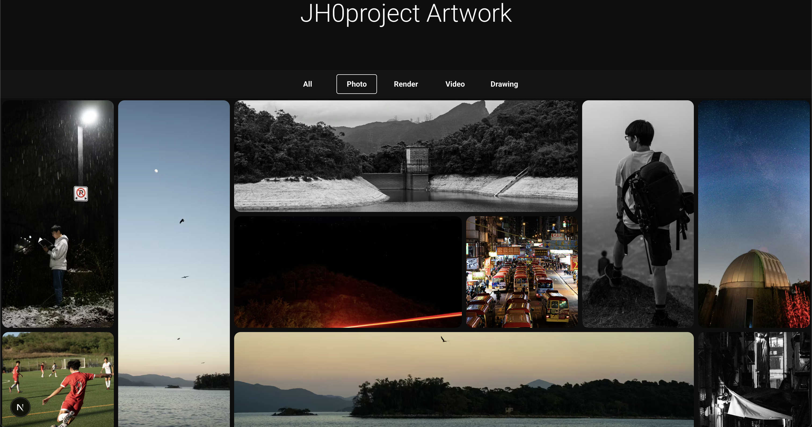

# react-adaptive-mosaic

Responsive **CSS Grid** mosaic layout for image galleries in **React**. Breakpoint switching uses **CSS media queries** (injected rules), so the layout is **SSR-friendly**: the server can emit the same markup the browser styles, without relying on `window` to pick a grid. Images are bucketed by aspect ratio, packed into a column count you choose per breakpoint, and rendered with a `renderCell` callback so you control markup (``, a lazy loader, or a framework-specific image component).

No **Next.js** or **MUI** dependency — only `react` and `react-dom`.

## Why this design

This layout is designed to solve a common problem for photographers: a single shoot often includes both tall portrait frames and wide landscape frames. Standard uniform grids, or row/column-first layouts common in other gallery libraries, often crop too aggressively or leave awkward whitespace. `react-adaptive-mosaic` packs mixed aspect ratios into a responsive, SSR-friendly mosaic so vertical and horizontal images can sit together naturally.

## Demo



Demo image location: `./assets/demo/mosaic-demo.png`

## Features

- **Breakpoint-aware layouts** — one grid per breakpoint; injected CSS and `@media` rules show only the matching range (responsive and SSR-friendly; no client-only breakpoint detection for which grid is visible).
- **Default breakpoint widths** — for keys `xs`–`xl`, min-widths are 0 / 600 / 900 / 1200 / 1536 px (same numbers as Material UI’s default theme, without using MUI). Custom key names get synthetic min-widths so every key still maps to a range.
- **Aspect-aware packing** — wide, tall, and square tiles are interleaved to fill the grid.
- **Scroll-friendly cells** — `AdaptiveMosaicGrid` toggles visibility for off-screen tiles to reduce work while scrolling (see `rowMargin`).
- **Optional Next-style image typing** — `ImageProps` / `MosaicImage` mirror common `next/image` prop shapes so you can pass the same data if you use Next elsewhere; the package does not ship or require `next`.

## Requirements

Peer dependencies (install in your app):

- `react` ^19.2.5  
- `react-dom` ^19.2.5  

## Install

```bash
yarn add react-adaptive-mosaic
```

Ensure the peer dependencies above are satisfied.

## Usage

```tsx
import { AdaptiveMosaic, type MosaicImage } from "react-adaptive-mosaic";

const images: MosaicImage[] = [
  {
    assetId: "1",
    src: "/photo-1.jpg",
    width: 1600,
    height: 900,
    alt: "Example",
  },
  // …
];

export function Gallery() {
  return (
    <AdaptiveMosaic
      images={images}
      breakpointColumnMapping={{
        xs: 2,
        sm: 3,
        md: 4,
        lg: 5,
        xl: 6,
      }}
      rowMargin={2}
      renderCell={({ image }) => (
        
      )}
    />
  );
}
```

Each image needs `assetId`, `src`, `width`, and `height`, plus `alt` (and any other fields you read inside `renderCell`).

If you use **Next.js App Router**, add `"use client"` to the file that imports `AdaptiveMosaic` (or a parent client component).

### Optional lightbox slot

Pass `lightbox` to render a sibling node (for example a portal or modal) next to the mosaic.

## API

| Export | Description |
|--------|-------------|
| `AdaptiveMosaic` | Root component: `images`, `breakpointColumnMapping`, `rowMargin`, `renderCell`, optional `lightbox`. |
| `AdaptiveMosaicGrid` | Lower-level grid wrapper used internally; exposes scroll-margin visibility behavior. |
| `ImageProps` | Extended ``-style props (Next-compatible optional fields); no `next` import. |
| `MosaicImage` | `ImageProps` plus `assetId`, `src`, `width`, `height`. |
| `LaidOutMosaicImage` | `MosaicImage` with layout fields: `top`, `left`, `widthBlock`, `heightBlock`. |
| `RenderMosaicCell` | `(ctx: { image, columns, rowMargin }) => ReactNode` |
| `StaticImageData` | Shape compatible with static image imports when typing `src`. |

## Scripts

```bash
yarn lint      # biome check
yarn lint:fix  # biome check --write
```

## License

MIT
